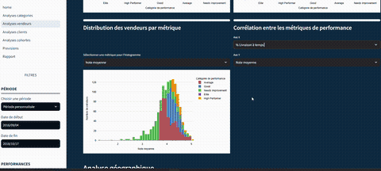

# 🚀 Projet d'Intelligence de Données Olist E-commerce 📊

## 📝 Présentation du Projet

Ce projet est une solution complète d'ingénierie de données et d'intelligence commerciale pour analyser Olist, une plateforme e-commerce brésilienne. En exploitant une modélisation de données avancée, des scripts Python et une visualisation interactive, le projet transforme des données brutes de commerce électronique en informations exploitables.

## Démo du Tableau de Bord

## 🔍 Caractéristiques du Jeu de Données
- **Plateforme** : Olist E-commerce
- **Période des Données** : 2016-2018
- **Nombre Total de Commandes** : Plus de 100 000 commandes

## 🛠 Architecture Technique

### Modélisation de Base de Données (DBeaver)
- Structure de base de données relationnelle
- Tables optimisées pour l'analyse
- Index améliorant les performances
- Vues matérialisées
- Procédures stockées pour des analyses récurrentes

### Écosystème Python
- **ORM** : SQLAlchemy pour les interactions de base de données
- **Gestion d'Environnement** : UV pour la gestion des dépendances
- **Catégories de Scripts** :
  1. Scripts de Documentation
  2. Scripts de Reporting Périodique
  3. Scripts de Maintenance de Base de Données
  4. Scripts de Nettoyage de Données

### Visualisation
- Tableau de Bord Streamlit Interactif
- Exploration dynamique de :
  - Performances de Ventes
  - Analyse de Catégories de Produits
  - Comportement Client
  - Prévisions de Ventes
  - Performance des Vendeurs

## 🧰 Compétences Techniques Démontrées
- SQL Avancé
- Optimisation de Base de Données
- Programmation Python
- ORM SQLAlchemy
- Segmentation Client RFM
- Analyse Prédictive
- Visualisation de Données Interactive

## 🚦 Exécution des Scripts
**Note Importante** : Tous les scripts sont déclenchés manuellement, non automatisés.

### Scripts de Documentation
- Génération de documentation technique
- Catalogage des objets de base de données (vues,fonctions,procédure,kpi)

### Scripts de Reporting
- Génération de rapports de KPI périodiques
- Suivi des métriques clés

### Scripts de Maintenance
- Analyse des performances de base de données
- Ré-indexation automatique
- Optimisation des requêtes
- Gestion préventive de la santé de la base de données

### Scripts de Prétraitement des Données
- Détection d'anomalies
- Nettoyage automatisé des données

## 🔗 Prérequis
- Python 3.11
- SQLAlchemy
- Streamlit
- UV (gestion des dépendances)

## 🚀 Démarrage
1. Cloner le dépôt
2. Installer les dépendances : `uv pip install -r requirements.txt`
3. Configurer la connexion à la base de données
4. Exécuter les scripts individuels selon les besoins
5. Lancer le tableau de bord Streamlit : `streamlit run olist-dashboard/home.py`

## 💬 Connecter & Collaborer
Intéressé par une collaboration technique ou une discussion sur les approches d'ingénierie de données ? Connectons-nous !

🔗 [Visitez mon Portfolio](https://francoisvercellotti.github.io/mon-portfolio/)

## 🏷️ Mots-clés
#IngénierieDeDonnées #IntelligenceCommerciale #Python #SQLAlchemy #AnalyseDeDonnées